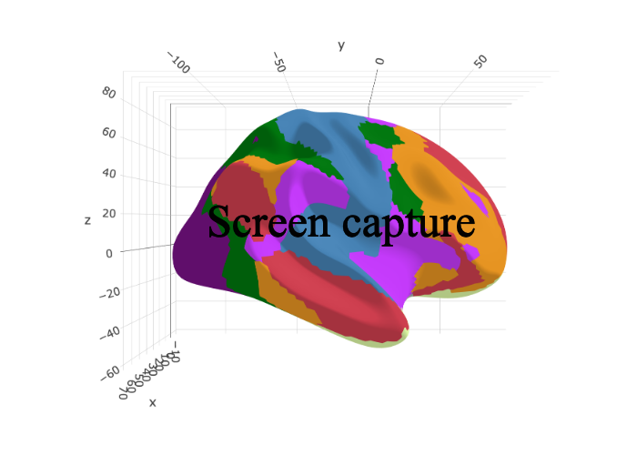

<!-- README.md is generated from README.Rmd. Please edit that file -->

```{r, include = FALSE}
knitr::opts_chunk$set(
  collapse = TRUE,
  comment = "#>",
  fig.path = "man/figures/README-",
  out.width = "100%",
  fig.retina = 3
)
```

# ggsegYeo2011 

<!-- badges: start -->
[](https://github.com/LCBC-UiO/ggsegYeo2011/actions)
[](https://zenodo.org/badge/latestdoi/250192046)
[](https://CRAN.R-project.org/package=ggsegYeo2011)
<!-- badges: end -->

This package contains dataset for plotting the Yeo2011 cortical atlas ggseg and ggseg3d. 

Yeo et al. (2011) J. Neurophysiology 16(3):1125-1165 [pubmed](https://www.ncbi.nlm.nih.gov/pubmed/21653723)

## Installation

We recommend installing the ggseg-atlases through the ggseg [r-universe](https://ggseg.r-universe.dev/ui#builds):

```{r eval = FALSE}
# Enable this universe
options(repos = c(
    ggseg = 'https://ggseg.r-universe.dev',
    CRAN = 'https://cloud.r-project.org'))

# Install some packages
install.packages('ggsegYeo2011')
```


You can install the released version version from [GitHub](https://github.com/) with:

```{r, eval = FALSE}
# install.packages("remotes")
remotes::install_github("LCBC-UiO/ggsegYeo2011")
```
## Example

This is a basic example which shows you how to solve a common problem:
```{r}
library(ggsegYeo2011)
```

```{r}
library(ggplot2)
library(ggseg)

plot(yeo7) +
  theme(legend.position = "bottom",
        legend.text = element_text(size = 9)) +
  guides(fill = guide_legend(ncol = 3))


plot(yeo17) +
  theme(legend.position = "bottom",
        legend.text = element_text(size = 9)) +
  guides(fill = guide_legend(ncol = 3))

```

```{r "noneval", eval=FALSE}
library(ggseg3d)
library(dplyr)

ggseg3d(atlas = yeo7_3d) %>% 
  pan_camera("right lateral")
``

```{r "orca", include=FALSE}
library(ggseg3d)
library(dplyr)


p <- ggseg3d(atlas = yeo7_3d) %>%
  pan_camera("right lateral") %>%
  plotly::add_annotations( text="Screen capture",
                  legendtitle=TRUE, showarrow=FALSE,
                  font = list(color = "#000000b4",
                              family = 'sans serif',
                              size = 50))
plotly::orca(p, "man/figures/README-yeo7-3d-plot.png")
```

```{r "incl", echo=FALSE}

```

```{r "noneval2", eval=FALSE}
ggseg3d(atlas = yeo17_3d) %>% 
  pan_camera("right lateral")
```

```{r "orca2", include=FALSE}
library(ggseg3d)

p <- ggseg3d(atlas = yeo17_3d) %>%
  pan_camera("right lateral") %>%
  plotly::add_annotations( text="Screen capture",
                  legendtitle=TRUE, showarrow=FALSE,
                  font = list(color = "#000000b4",
                              family = 'sans serif',
                              size = 50))
plotly::orca(p, "man/figures/README-yeo17-3d-plot.png")
```

```{r "incl2", echo=FALSE}
knitr::include_graphics("man/figures/README-yeo17-3d-plot.png")
```


Please note that the 'ggsegYeo2011' project is released with a
[Contributor Code of Conduct](CODE_OF_CONDUCT.md).
By contributing to this project, you agree to abide by its terms.
