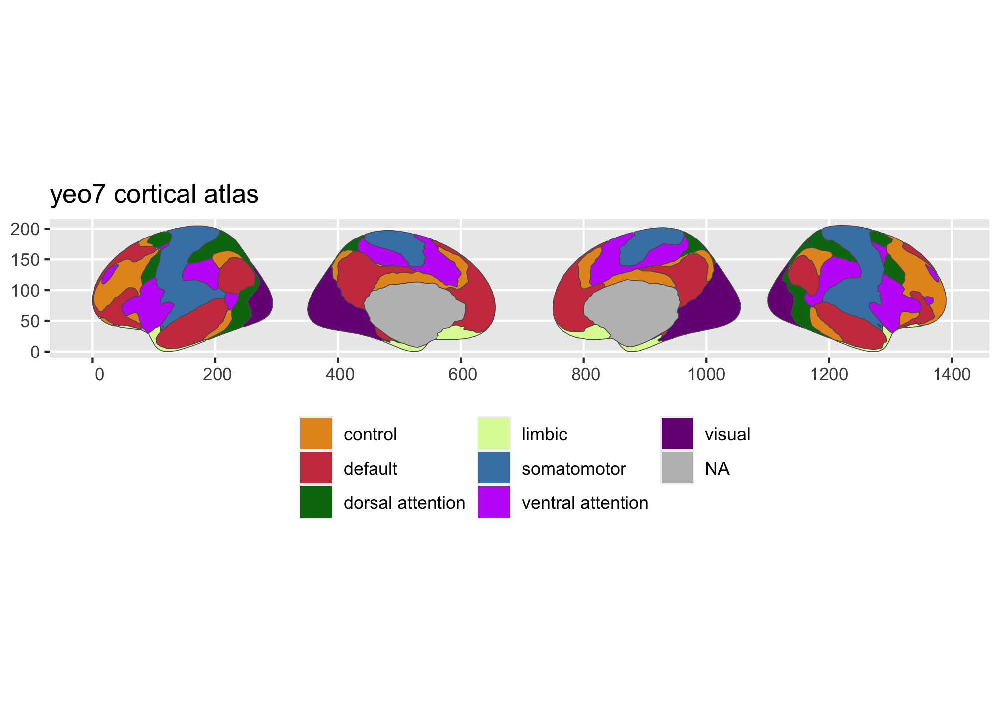
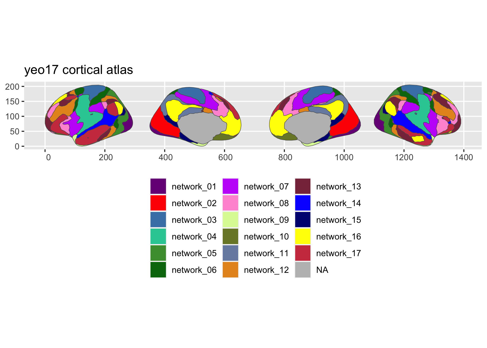

<!-- README.md is generated from README.Rmd. Please edit that file -->

# ggsegYeo2011

<!-- badges: start -->

[](https://codecov.io/gh/LCBC-UiO/ggsegYeo2011?branch=master)
[](https://github.com/LCBC-UiO/ggsegYeo2011/actions)
<!-- badges: end -->

This package contains dataset for plotting the Yeo2011 cortical atlas
ggseg and ggseg3d.

Yeo et al. (2011) J. Neurophysiology 16(3):1125-1165
[pubmed](https://www.ncbi.nlm.nih.gov/pubmed/21653723)

## Installation

You can install the released version version from
[GitHub](https://github.com/) with:

``` r
# install.packages("remotes")
remotes::install_github("LCBC-UiO/ggsegYeo2011")
```

## Example

This is a basic example which shows you how to solve a common problem:

``` r
library(ggsegYeo2011)
```

``` r
library(ggplot2)
library(ggseg)

plot(yeo7) +
  theme(legend.position = "bottom",
        legend.text = element_text(size = 9)) +
  guides(fill = guide_legend(ncol = 3))
```



``` r

plot(yeo17) +
  theme(legend.position = "bottom",
        legend.text = element_text(size = 9)) +
  guides(fill = guide_legend(ncol = 3))
```



``` r
library(ggseg3d)
library(dplyr)

ggseg3d(atlas = yeo7_3d) %>% 
  pan_camera("right lateral")
``
```


``` r
ggseg3d(atlas = yeo17_3d) %>% 
  pan_camera("right lateral")
```


Please note that the ‘ggsegYeo2011’ project is released with a
[Contributor Code of Conduct](CODE_OF_CONDUCT.md). By contributing to
this project, you agree to abide by its terms.
